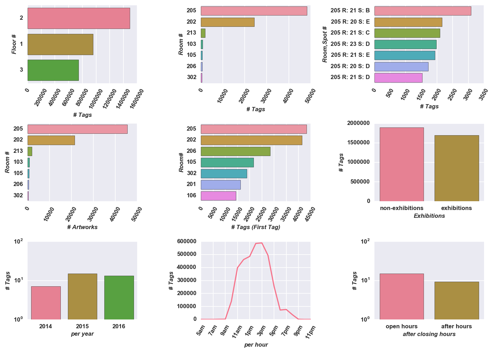

# Cooper Hewitt
For many years, approximately 3-4 years, the Cooper Hewitt design museum was closed while it
underwent a renovation.  During this time they overhauled their technology to create
an immersive experience for the visitor, whereby visitors would interact with the technology.  During this
time "The Pen" was born which allowed the museum to track which artworks (objects) were being interacted with via
recorded timestamps and artwork identifiers.  Visitors can tag artworks or create designs of their own at representative
stations, which bring up similar artworks.  Recently all this information has been made openly available to the public,
in de-identified bundles to protect the privacy of the visitors.

So why do visitors tag objects in the first place?  As part of the museum experience, all artwork visitors tag or create
can be visited online via their account.  Therefore they have a vested interest in them tagging.

## Project Description
Aggregating the Pen data and Collection metadata (metadata about an artwork) can give further insights
into how the museum is effectively using their assets and resources, notably "The Pen" and how exhibitions
are planned and artworks chosen.  As the museum is heavily focused on improving the experience factor for
the visitors, understanding the behavioral patterns and relationships would be a value-add to the them.

We will look at a few of the visitor behavior patterns:
- the sequence in which visitors visit artworks in a given day
- how often visitors tag within a given span (currently configured for 10m intervals)
- Influential Artworks based on votes of importance (Directed Graph)
- Are their groups of visitors attracted to exhibitions
- Are similar artworks not part of an exhibition getting attention
- Are certain Locations {Rooms, Spots, Floors} being visited and is their a pattern to them
- Can visitors be classified into groups based on their tagging behavior and what they tag
- Are there better arrangements of the stations and artwork

The primary goal is to understand how the visitors are interacting with the museum so that the experience
can be further improved.  In addition, a lot of effort goes into planning exhibitions, exhibition planning
can be further improved by understanding the visitor patterns.

For a further breakdown please review the [slide deck](docs/CooperHewitt.pdf).

## Exploratory Analysis
Lets take a quick peak of how the pen is being used and some of the metadata about Cooper Hewitt.

 
An analysis based on feature engineering from aggregating Pen data and the Collections Metadata API.

 
Top Communities from Spark GraphX processing via plotting of iGraph.

You can view an interactive diagram [here](https://plot.ly/~akamlani/84/artwork/), where hovering shows the type of art.

## Cooper Hewitt Data Sources
- [De-identified Pen Data](https://github.com/cooperhewitt/the-pen-data/)
    - The museum provides a digital pen to each visitor upon entry to tag artwork they are interested in.  
    In addition they can use the pen to draw shapes that are most similar to these artworks at select stations,
    which will bring up the associated artwork metadata at the station.  Each time the pen tags an object (artwork);
    it is recorded with a timestamp.  All this data is de-identified data recorded as “bundles”.

- [Collection Metadata](https://collection.cooperhewitt.org/api/methods/)
    - Object artwork metadata has been exposed through restful API’s via multiple endpoints.  Curators have
    digitized object metadata where available; therefore not all metadata may be available for a particular artwork,
    nor normalized in any format.  This metadata will provide additional features and context to the object being
    tagged.  Included in this metadata, are the locations (rooms, spots) where artwork has appeared.

## Configuration (API Keys)
- Fill in the appropriate sections in config/api_cred.yml based on registration with Cooper Hewitt.

## Data (Transformed)
- collection_objects: Metadata about particular artworks and locations within the museum
- pen_collected_items: De-identified Tracked Pen data for a particular visitor

## Libraries/Components
- AWS: EC2, S3
- Spark (pyspark):  Spark SQL, MLLib, GraphX/GraphFrames
- Core Python Libraries: igraph, networkx, boto, pymongo, sklearn, pandas, numpy, seaborn/matplotlib  

## Cooper Hewitt Resources
- [Cooper Hewitt Labs](http://labs.cooperhewitt.org)
- [Collection Stats](http://collection.cooperhewitt.org/stats)
- Articles
    - [Citizen Curation](http://tfmorris.blogspot.com/2012/10/citizen-curation-of-smithsonian-metadata.html)
    - [Happy Birthday for the Pen](http://labs.cooperhewitt.org/2016/a-very-happy-open-birthday-for-the-pen/)

## Additional Resources
- [Hierarchical Clustering](https://joernhees.de/blog/2015/08/26/scipy-hierarchical-clustering-and-dendrogram-tutorial/)
